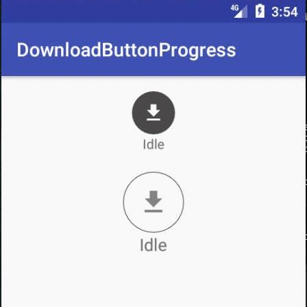
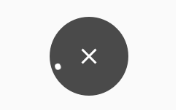
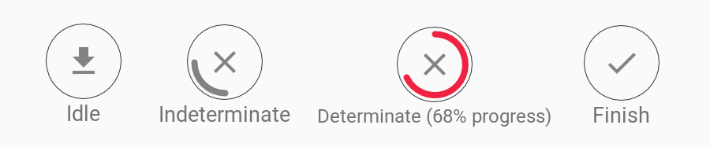

# AndroidButtonProgress
This is a combination of button and progress bar. There are 4 states in this view first Idle, Indeterminate, Determinate and Finish. it makes you easy to manage download button state in your app ui.

In a download case you can use this as.

- 1st show download button to the user
- 2nd show indeterminate progress bar, it tells the user that the download is connecting.
- 3rd show determinate progress bar, which tells the user that the download is progressing
- 4th show finish button/icon

## Demo

## Usage
Use jitpack
~~~
allprojects {
	repositories {
		maven { url 'https://jitpack.io' }
	}
}
~~~
Gradle
~~~
dependencies {
        compile 'com.github.abdularis:androidbuttonprogress:v0.1-alpha4'
}
~~~

Please always use same width and height for this button progress view
~~~xml
<com.github.abdularis.buttonprogress.DownloadButtonProgress
	android:layout_width="45dp"
	android:layout_height="45dp"/>
~~~

You can also
~~~xml
<com.github.abdularis.buttonprogress.DownloadButtonProgress
	android:layout_width="72dp"
	android:layout_height="72dp"
	app:progressIndeterminateSweepAngle="1"
	app:state="INDETERMINATE"/>
~~~

Use custom drawable for every state
~~~xml
<com.github.abdularis.buttonprogress.DownloadButtonProgress
	android:id="@+id/button_progress_2"
	android:layout_width="64dp"
	android:layout_height="64dp"
	android:layout_marginTop="20dp"
	app:idleIconDrawable="@drawable/ic_download"
	app:idleBackgroundDrawable="@drawable/bg_button_progress"
	app:cancelIconDrawable="@drawable/ic_cancel"
	app:indeterminateBackgroundDrawable="@drawable/bg_button_progress"
	app:progressIndeterminateColor="#828282"
	app:determinateBackgroundDrawable="@drawable/bg_button_progress"
	app:progressDeterminateColor="#ef2241"
	app:finishIconDrawable="@drawable/ic_finish"
	app:finishBackgroundDrawable="@drawable/bg_button_progress"/>
~~~

> **Note:** you can use DownloadButtonProgress as upload button too just replace the idle download icon with upload icon! :)

Click listener
~~~java
DownloadButtonProgress btn = findViewById(R.id.button_progress_id);

btn.addOnClickListener(new DownloadButtonProgress.OnClickListener() {
	@Override
	public void onIdleButtonClick(View view) {
		// called when download button/icon is clicked
	}

	@Override
	public void onCancelButtonClick(View view) {
		// called when cancel button/icon is clicked
	}

	@Override
	public void onFinishButtonClick(View view) {
		// called when finish button/icon is clicked
	}
});
~~~
attrs for DownloadButtonProgress
~~~xml
<declare-styleable name="DownloadButtonProgress">
	<attr name="state" format="enum">
		<enum name="IDLE" value="1"/>
		<enum name="INDETERMINATE" value="2"/>
		<enum name="DETERMINATE" value="3"/>
		<enum name="FINISHED" value="4"/>			
	</attr>
	<attr name="cancelable" format="boolean"/>
	<attr name="hideOnFinish" format="boolean"/>
	<attr name="progressIndeterminateSweepAngle" format="integer"/>

	<attr name="idleBackgroundColor" format="color"/>
	<attr name="finishBackgroundColor" format="color"/>
	<attr name="indeterminateBackgroundColor" format="color"/>
	<attr name="determinateBackgroundColor" format="color"/>

	<attr name="idleBackgroundDrawable" format="reference"/>
	<attr name="finishBackgroundDrawable" format="reference"/>
	<attr name="indeterminateBackgroundDrawable" format="reference"/>
	<attr name="determinateBackgroundDrawable" format="reference"/>

	<attr name="progress" format="integer"/>
	<attr name="maxProgress" format="integer"/>
	<attr name="progressWidth" format="dimension"/>
	<attr name="progressMargin" format="dimension"/>
	<attr name="progressDeterminateColor" format="color"/>
	<attr name="progressIndeterminateColor" format="color"/>

	<attr name="idleIconDrawable" format="reference"/>
	<attr name="idleIconWidth" format="dimension"/>
	<attr name="idleIconHeight" format="dimension"/>

	<attr name="cancelIconDrawable" format="reference"/>
	<attr name="cancelIconWidth" format="dimension"/>
	<attr name="cancelIconHeight" format="dimension"/>

	<attr name="finishIconDrawable" format="reference"/>
	<attr name="finishIconWidth" format="dimension"/>
	<attr name="finishIconHeight" format="dimension"/>
</declare-styleable>
~~~